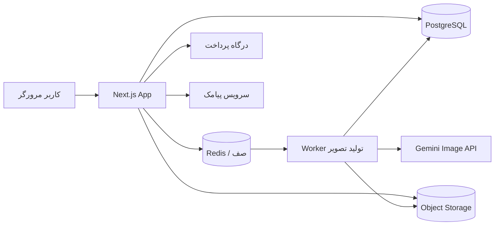

# TRD سند نیازمندی‌های فنی: وب‌سایت مزون لباس عروس

**نسخه:** ۰.۱ | **مرتبط با:** PRD وب‌سایت مزون لباس عروس | **پشته اصلی:** Next.js + تولید تصویر با Google Nano Banana (Gemini Image)

---

## ۱. هدف سند

این سند نحوه پیاده‌سازی فنی PRD را مشخص می‌کند: معماری، فناوری‌ها، مدل داده، APIها، ماژول تولید تصویر با Gemini، لندینگ WebGL، امنیت، استقرار و ریسک‌ها.

## ۲. تصمیم‌های فنی کلیدی

| موضوع | تصمیم |
| --- | --- |
| فریمورک | Next.js (App Router، آخرین نسخه پایدار) + TypeScript |
| تولید تصویر | Google Gemini Image API (Nano Banana) از طریق SDK رسمی `@google/genai`، فقط سمت سرور |
| لندینگ سه‌بعدی | Three.js با React Three Fiber و شیدر GLSL سفارشی |
| پایگاه داده | PostgreSQL + Prisma |
| صف کار | Redis + BullMQ (تولید تصویر غیرهمزمان) |
| ذخیره فایل | فضای سازگار با S3 (MinIO یا سرویس ابری داخلی/بین‌المللی) |
| احراز هویت | ورود با شماره موبایل و OTP پیامکی، نشست با کوکی httpOnly |
| پرداخت | درگاه بانکی ایرانی (مثل زرین‌پال) |
| استایل | Tailwind CSS با پشتیبانی RTL، فونت وزیرمتن (self-host) |

## ۳. معماری سطح بالا



**اجزا:**

- **Next.js App:** صفحات (SSR/ISR)، Route Handlerها برای API، پنل مدیر.
- **Worker:** پردازش جداگانه Node که کارهای صف را می‌خواند، با Gemini ارتباط می‌گیرد، تصویر را واترمارک و ذخیره می‌کند.
- **جداسازی Worker از وب‌اپ** این امکان را می‌دهد که Worker در منطقه‌ای مستقر شود که دسترسی قانونی به API گوگل دارد (بخش ۱۴).

## ۴. ساختار پروژه (پیشنهادی)

```
/src
  /app
    (site)/page.tsx            # لندینگ
    (site)/gowns/...           # گالری و جزئیات مدل
    (site)/booking/...         # رزرو
    (site)/account/tryon/...   # پرو آنلاین، کیف اعتبار، دعوت
    admin/...                  # پنل مدیر
    api/...                    # Route Handlers
  /components/landing          # صحنه WebGL
  /lib/ai                      # ارائه‌دهنده تصویر (Provider)
  /lib/credits                 # منطق اعتبار
  /lib/payments, /lib/sms, /lib/storage
/worker                        # پردازنده صف
/prisma/schema.prisma
```

## ۵. مدل داده (جداول اصلی)

| جدول | فیلدهای کلیدی |
| --- | --- |
| users | id, phone (unique), referral_code (unique), referred_by, created_at |
| otp_codes | phone, code_hash, expires_at, attempts |
| gowns | id, slug, name, description, type, style, color, mode (sale/rent), status, images\[\] |
| credit_ledger | id, user_id, type (`free_signup`, `referral_bonus`, `purchase`, `consume`, `refund`), amount (+/−), bucket (`free`/`paid`), ref_id, created_at |
| payments | id, user_id, package_id, amount_irr, authority, ref_number, status, created_at |
| credit_packages | id, title, credits, price_irr, active |
| tryon_jobs | id, user_id, gown_id, input_image_key, status (`queued`/`running`/`done`/`failed`), bucket_used, result_key, error, created_at |
| referrals | id, inviter_id, invitee_id, status (`registered`/`charged`/`rewarded`/`revoked`), reward_ledger_id |
| bookings | id, name, phone, event_date, preferred_time, gown_id, status |
| settings | key, value (سهمیه رایگان، پاداش دعوت، سقف دعوت) |
| audit_logs | actor, action, meta, created_at |

**اصل مهم:** موجودی اعتبار **از ledger محاسبه می‌شود** (جمع ردیف‌ها)، نه از یک عدد قابل تغییر؛ این کار ردگیری و بازگشت اعتبار را ساده و دقیق می‌کند. بخش (bucket) برای تفکیک اعتبار رایگان و پولی لازم است، چون تصاویر رایگان قابل دانلود نیستند.

## ۶. منطق اعتبار و سهمیه

**هنگام ثبت‌نام:** درج ۳ اعتبار `free_signup` (در `bucket=free`).

**هنگام درخواست پرو (داخل تراکنش دیتابیس):**

1. موجودی بخش free را بررسی کن؛ اگر >۰ از آن، وگرنه از paid کسر کن.
2. اگر هر دو صفر بود، پاسخ `402` (نیاز به شارژ).
3. ردیف `consume` با وضعیت رزرو ایجاد کن و job بساز.
4. پس از موفقیت، رزرو تأیید می‌شود؛ در شکست، ردیف `refund` ثبت می‌شود.

**دعوت دوستان:**

- ثبت‌نام با کد دعوت ← `referrals.status = registered`.
- پس از تأیید اولین پرداخت موفق دعوت‌شونده ← وضعیت `charged` و ثبت ۳ اعتبار `referral_bonus` (bucket=free) برای دعوت‌کننده ← `rewarded`.
- بازگشت/ابطال پرداخت ← ثبت ledger منفی و وضعیت `revoked`.
- اعمال سقف دعوت از `settings`.
- پاداش فقط یک‌بار به‌ازای هر دعوت‌شونده (قید یکتایی روی `invitee_id`).

**Idempotency:** هر پرداخت و هر job کلید یکتا دارد تا کسر یا شارژ دوباره رخ ندهد.

## ۷. ماژول تولید تصویر (Gemini / Nano Banana)

### ۷.۱ مدل‌ها

نام‌های مدل‌ها در زمان نگارش این سند (باید قبل از پیاده‌سازی در مستندات رسمی Google AI دوباره بررسی شود، چون نام‌گذاری و قیمت تغییر می‌کند):

| مدل | شناسه | کاربرد در پروژه |
| --- | --- | --- |
| Nano Banana 2 | `gemini-3.1-flash-image` | **پرو آنلاین کاربران** (تعادل سرعت، کیفیت و هزینه) |
| Nano Banana 2 Lite | `gemini-3.1-flash-lite-image` | گزینه ارزان‌تر و سریع‌تر (فقط ۱K) برای مرحله بعد یا حالت اقتصادی |
| Nano Banana Pro | `gemini-3-pro-image` | **تولید دارایی‌های لندینگ** (عروس مرجع، لباس‌ها) با بالاترین کیفیت |
| Nano Banana (اصلی) | `gemini-2.5-flash-image` | جایگزین ارزان در صورت نیاز |

شناسه مدل‌ها در متغیر محیطی نگهداری می‌شود (نه داخل کد) تا تغییر مدل بدون استقرار مجدد ممکن باشد. قیمت هر تصویر در منابع غیررسمی از حدود ۰٫۰۳ تا ۰٫۱۵ دلار بسته به مدل و رزولوشن گزارش شده است؛ قیمت قطعی را از صفحه قیمت رسمی Gemini API بگیرید و برای تعیین قیمت بسته‌های شارژ استفاده کنید.

### ۷.۲ الگوی ارائه‌دهنده (Provider)

```ts
// lib/ai/provider.ts
export interface TryOnProvider {
  generate(input: {
    personImage: Buffer;      // عکس کاربر
    gownImages: Buffer[];     // عکس‌های مرجع لباس مزون
    prompt: string;
  }): Promise<{ image: Buffer; mime: string }>;
}
```

پیاده‌سازی Gemini (نمونه):

```ts
import { GoogleGenAI } from "@google/genai";
const ai = new GoogleGenAI({ apiKey: process.env.GEMINI_API_KEY! });

const res = await ai.models.generateContent({
  model: process.env.GEMINI_TRYON_MODEL!, // مثلا gemini-3.1-flash-image
  contents: [
    { text: prompt },
    { inlineData: { mimeType: "image/jpeg", data: personB64 } },
    { inlineData: { mimeType: "image/jpeg", data: gownB64 } },
  ],
});
const part = res.candidates?.[0]?.content?.parts?.find(p => p.inlineData);
const image = Buffer.from(part!.inlineData!.data!, "base64");
```

(کد نمونه است و باید با مستندات نسخه SDK مطابقت داده شود.) به دلیل الگوی Provider، جایگزینی Gemini با ارائه‌دهنده دیگر بدون تغییر منطق کسب‌وکار ممکن است.

### ۷.۳ پرامپت پرو آنلاین (الگو)

> «تصویر اول عکس شخص است. تصویر دوم لباس عروس مشخص است. همان شخص را با همان چهره، فرم بدن، حالت و پس‌زمینه نشان بده، در حالی که لباس عروس تصویر دوم را پوشیده است. جزئیات پارچه، یقه و دنباله لباس را حفظ کن. چهره و رنگ پوست را تغییر نده.»

پرامپت در فایل پیکربندی/پایگاه داده نگهداری می‌شود تا بدون استقرار قابل بهبود باشد.

### ۷.۴ اجرای غیرهمزمان

1. `POST /api/tryon` ← اعتبارسنجی، رزرو اعتبار، ذخیره عکس، ساخت job، قرار دادن در صف ← پاسخ `202` با `jobId`.
2. Worker: دریافت job، فراخوانی Gemini با timeout سخاوتمندانه (مدل‌های بزرگ‌تر کندتر هستند)، تلاش مجدد محدود (۲ بار) با backoff برای خطاهای موقت.
3. پس‌پردازش با `sharp`: ساخت نسخه **پیش‌نمایش واترمارک‌دار با رزولوشن پایین** (برای پروهای رایگان) و نسخه اصلی (برای پروهای پولی).
4. وضعیت job در DB به‌روز می‌شود؛ کلاینت با polling (هر ۲ ثانیه) یا SSE پیشرفت را می‌گیرد.
5. خطا ← refund و پیام قابل فهم.

### ۷.۵ ایمنی و کنترل محتوا

- بررسی نوع و محتوای عکس ورودی (رد تصاویر نامناسب، تصویر چند نفر، کودک) قبل از ارسال به Gemini، با فیلترهای ایمنی خود API و بررسی ساده سمت سرور.
- مدیریت پاسخ‌های مسدودشده توسط فیلتر ایمنی: عدم کسر اعتبار و پیام مناسب.
- ذخیره نشدن کلید API در کلاینت؛ همه فراخوانی‌ها فقط از سرور.
- تصاویر تولیدشده توسط Gemini ممکن است نشانگر (SynthID) داشته باشند؛ با این موضوع در قوانین استفاده شفاف رفتار شود.

### ۷.۶ تولید دارایی‌های لندینگ (آفلاین)

یک اسکریپت CLI (`scripts/generate-assets.ts`) با مدل Pro:

1. تولید و انتخاب **عروس مرجع** و داماد.
2. برای هر لباس: ورودی = عروس مرجع + عکس‌های مرجع لباس + پرامپت «فقط لباس را تغییر بده، چهره، پوز و نور ثابت بماند».
3. ذخیره تمام خروجی‌ها برای بازبینی انسانی؛ فقط تصاویر تأییدشده وارد `public/landing` می‌شوند.
4. پس‌پردازش: حذف پس‌زمینه، جداسازی لایه‌ها، نقشه عمق (مدل تخمین عمق)، لایه چشم‌ها، تبدیل به WebP/KTX2.

این بخش یک‌بار اجرا می‌شود و نیازی به API در زمان اجرای سایت ندارد؛ بنابراین سایت اصلی تحت تأثیر دسترسی به Gemini قرار نمی‌گیرد.

## ۸. لندینگ WebGL

**پیاده‌سازی:** کامپوننت کلاینتی با `React Three Fiber`، بارگذاری با `next/dynamic` و `ssr: false`؛ HTML اصلی (H1، توضیح، دکمه‌ها) سمت سرور رندر می‌شود تا سئو و صفحه‌خوان کار کند.

**صحنه:**

- لایه‌ها (پس‌زمینه، داماد، عروس، ذرات) روی صفحه‌های جداگانه با فاصله عمق متفاوت.
- شیدر عمق: جابجایی UV بر اساس نقشه عمق و موقعیت نشانگر برای پارالاکس.
- داماد با عمق میدان (blur ملایم) و مقیاس کوچک‌تر.

**دنبال‌کردن چشم:**

- نقطه نشانگر به مختصات نرمال تبدیل می‌شود، با `lerp` نرم می‌شود و در زاویه حداکثر (clamp) محدود می‌گردد.
- لایه عنبیه/مردمک با offset کوچک روی مش جداگانه حرکت می‌کند؛ سر ۲ تا ۳ درجه می‌چرخد.
- موبایل: `deviceorientation` (در iOS با درخواست مجوز کاربر) یا لمس.

**ترنسیشن‌ها:** یک شیدر برای هر ترنسیشن (`uProgress` ۰ تا ۱، دو بافت `uFrom/uTo`): نویز مایع، موج پارچه، جاروب نوری با درخشش، پرده‌ای، ذرات، دایره‌ای. هر لباس در کانفیگ JSON یک ترنسیشن دارد.

**عملکرد:**

- سقف `dpr` مثلاً ۱٫۵ در موبایل، `PerformanceMonitor` برای کاهش خودکار کیفیت.
- بافت‌ها KTX2/WebP، بارگذاری لباس بعدی در پس‌زمینه.
- توقف رندر هنگام پنهان بودن تب (`visibilitychange`) و خارج از دید.
- پوستر استاتیک ابتدا (`next/image` با `priority`) برای LCP.
- Fallback: اسلایدر CSS در صورت نبود WebGL، ضعف دستگاه یا `prefers-reduced-motion`.
- بودجه: کمتر از ۲ مگابایت برای بارگذاری اولیه (JS و بافت‌های ضروری).

## ۹. محدودیت دانلود تصاویر رایگان

- تصاویر پرو در bucket خصوصی ذخیره می‌شوند و فقط از طریق **URL امضاشده کوتاه‌مدت** (چند دقیقه) و پس از احراز مالکیت سرو می‌شوند.
- برای پروهای رایگان: فقط نسخه پیش‌نمایش واترمارک‌دار با رزولوشن پایین؛ نسخه اصلی از طریق API قابل دریافت نیست.
- هدرها: `Cache-Control: private, no-store`، `Content-Disposition: inline`.
- در UI: غیرفعال‌کردن کلیک راست و drag؛ نمایش روی `canvas` اختیاری.
- نسخه کامل برای پروهای پولی از طریق مسیر دانلود جدا و مجاز.
- **محدودیت واقعی:** اسکرین‌شات را نمی‌توان کاملاً مسدود کرد؛ واترمارک و پایین‌بودن کیفیت، بازدارنده اصلی‌اند.

## ۱۰. فهرست APIها (خلاصه)

| متد و مسیر | توضیح |
| --- | --- |
| POST `/api/auth/otp/request` | ارسال کد؛ محدودیت نرخ |
| POST `/api/auth/otp/verify` | تأیید کد و ساخت نشست |
| GET `/api/me` | پروفایل، موجودی (free/paid)، لینک دعوت |
| POST `/api/tryon` | درخواست پرو (آپلود عکس + gownId) |
| GET `/api/tryon/:id` | وضعیت و آدرس نتیجه |
| GET `/api/tryon` | تاریخچه پروها |
| DELETE `/api/tryon/:id` | حذف عکس و نتیجه |
| GET `/api/credits/packages` | بسته‌های شارژ |
| POST `/api/payments/start` | شروع پرداخت |
| GET `/api/payments/callback` | بازگشت از درگاه و تأیید (verify) سمت سرور |
| GET `/api/referrals` | وضعیت دعوت‌ها |
| POST `/api/bookings` | رزرو وقت پرو حضوری |
| GET/POST `/api/admin/*` | مدیریت لباس‌ها، تنظیمات، گزارش‌ها (نقش admin) |

اعتبارسنجی ورودی با `zod` در همه Route Handlerها.

## ۱۱. امنیت

- OTP: ذخیره به‌صورت hash، انقضای ۲ دقیقه، حداکثر ۵ تلاش، محدودیت ارسال برای هر شماره و IP.
- نشست: کوکی `httpOnly`، `Secure`، `SameSite=Lax`؛ محافظت CSRF برای درخواست‌های تغییر وضعیت.
- آپلود: بررسی نوع واقعی فایل (magic bytes)، حداکثر حجم (مثلاً ۸MB)، حذف EXIF و موقعیت مکانی، تغییر اندازه سمت سرور.
- حریم خصوصی: رمزنگاری در حالت سکون (بر اساس فضای ذخیره‌سازی)، حذف خودکار عکس اصلی بعد از ۳۰ روز با cron/صف، حذف دستی توسط کاربر.
- پرداخت: تأیید تراکنش فقط سمت سرور، قید یکتایی روی `authority`، عدم ذخیره اطلاعات کارت.
- ضد سوءاستفاده: محدودیت نرخ (Redis) برای `/tryon` و OTP، تشخیص دستگاه/IP مشترک، قید یک شماره = یک سهمیه رایگان.
- مدیر: نقش‌ها، لاگ عملیات، ورود جداگانه با احراز قوی‌تر.
- مدیریت اسرار: متغیرهای محیطی، چرخش کلیدها؛ کلید Gemini فقط در Worker/سرور.
- هدرهای امنیتی (CSP، HSTS) و به‌روزرسانی وابستگی‌ها.

## ۱۲. سئو و عملکرد وب

- صفحات گالری و جزئیات مدل با SSG/ISR (revalidate پس از ویرایش مدیر).
- Metadata API برای عنوان، توضیح و Open Graph؛ `sitemap.xml` و `robots.txt` پویا.
- JSON-LD: `LocalBusiness`, `Product`, `BreadcrumbList`, `FAQPage`.
- `next/image` و فرمت WebP/AVIF، فونت self-host با `next/font`.
- هدف Core Web Vitals: LCP \< 2٫5s، CLS \< 0٫1، INP \< 200ms.
- ریسپانسیو RTL، آدرس‌های فارسی تمیز (slug).

## ۱۳. استقرار و زیرساخت

- **کانتینر:** Docker (وب‌اپ، Worker، PostgreSQL، Redis، MinIO در محیط توسعه)؛ `docker compose` برای توسعه و استقرار ساده.
- **محیط‌ها:** development، staging، production با پیکربندی جداگانه.
- **CI/CD:** GitHub Actions/GitLab CI: lint، تایپ‌چک، تست، build، استقرار.
- **پشتیبان‌گیری:** پشتیبان روزانه PostgreSQL و فضای ذخیره‌سازی؛ تست بازیابی ماهانه.
- **پایش:** لاگ ساخت‌یافته، مانیتورینگ زمان صف و نرخ خطای Gemini، هشدار برای هزینه غیرعادی تولید تصویر، Sentry یا معادل.
- **CDN:** برای فایل‌های ثابت و بافت‌های لندینگ.

**متغیرهای محیطی اصلی:** `DATABASE_URL`, `REDIS_URL`, `STORAGE_*`, `GEMINI_API_KEY`, `GEMINI_TRYON_MODEL`, `GEMINI_ASSET_MODEL`, `SMS_API_KEY`, `PAYMENT_MERCHANT_ID`, `SESSION_SECRET`, `FREE_QUOTA`, `REFERRAL_REWARD`.

## ۱۴. ریسک مهم: دسترسی به API گوگل از ایران

دسترسی به Google Gemini API از داخل ایران ممکن است به‌دلیل محدودیت‌های جغرافیایی و تحریم‌ها مسدود باشد و شرایط استفاده ملی/حقوقی هم باید بررسی شود. این موضوع مستقیم روی «پرو آنلاین» اثر دارد، چون هر درخواست پرو به این API نیاز دارد. من وکیل نیستم؛ لازم است پیش از ساخت پروژه این را بررسی کنید:

1. آیا استفاده تجاری از Gemini API برای کسب‌وکار شما و کاربرانتان در ایران مجاز و ممکن است؟
2. حساب و صورتحساب Google/Vertex تحت چه نهاد و کدام کشور قرار می‌گیرد؟
3. Worker تولید تصویر کجا مستقر می‌شود؟ (طراحی معماری این امکان را می‌دهد که فقط Worker در منطقه‌ای مجاز اجرا شود و وب‌اپ در ایران بماند.)

**کاهش ریسک در طراحی:**

- الگوی Provider (بخش ۷.۲) برای جایگزینی سریع ارائه‌دهنده.
- دارایی‌های لندینگ آفلاین ساخته می‌شوند و به API در زمان اجرا وابسته نیستند.
- اگر پرو آنلاین موقتاً در دسترس نباشد: پیام شفاف، عدم کسر اعتبار و پیشنهاد رزرو حضوری.
- از دور زدن محدودیت‌ها با روش‌های غیرمجاز پرهیز شود؛ راهکار باید قانونی و مورد تأیید مشاور حقوقی باشد.

## ۱۵. تست و کیفیت

- **واحد:** منطق اعتبار (کسر free/paid، refund، سقف دعوت) با تست‌های دقیق.
- **یکپارچگی:** جریان پرداخت با درگاه آزمایشی، OTP با سرویس mock.
- **E2E (Playwright):** ثبت‌نام ← پرو رایگان ← اتمام سهمیه ← شارژ ← پرو پولی ← دعوت.
- **AI:** مجموعه ثابت عکس‌های آزمایشی برای سنجش کیفیت و ثبات خروجی پس از تغییر مدل یا پرامپت؛ رد/تأیید دستی.
- **عملکرد:** Lighthouse و آزمون روی موبایل‌های واقعی میان‌رده برای لندینگ.
- **بار:** تست صف و Worker با تعداد هم‌زمان درخواست پرو.

## ۱۶. مراحل اجرا

| هفته | کار فنی |
| --- | --- |
| ۱ | راه‌اندازی پروژه، DB، احراز هویت OTP، طراحی دیزاین‌سیستم RTL |
| ۱ تا ۳ | بررسی دسترسی Gemini، تولید دارایی‌های لندینگ با اسکریپت آفلاین |
| ۲ تا ۴ | گالری، جزئیات مدل، رزرو، پنل مدیر پایه |
| ۳ تا ۶ | لندینگ WebGL، ترنسیشن‌ها، fallback و بهینه‌سازی |
| ۴ تا ۷ | ماژول پرو (صف، Worker، Gemini)، ledger و سهمیه |
| ۶ تا ۸ | پرداخت، دعوت، محدودیت دانلود، حذف خودکار عکس‌ها |
| ۸ تا ۹ | تست کامل، امنیت، سئو، استقرار و پایش |

## ۱۷. پرسش‌های باز فنی

1. محل میزبانی وب‌اپ و Worker و وضعیت دسترسی قانونی به Gemini چیست؟
2. کدام مدل برای پرو کاربران (کیفیت/هزینه) نهایی شود؟ پیشنهاد: آزمون A/B بین `gemini-3.1-flash-image` و `gemini-3.1-flash-lite-image`.
3. کدام درگاه پرداخت و سرویس پیامک استفاده شود؟
4. فضای ذخیره‌سازی داخلی یا ابری بین‌المللی؟
5. آیا کیفیت پرو با یک عکس مرجع از لباس کافی است یا چند زاویه لازم است؟ (نیاز به آزمون با نمونه واقعی)
6. تیم توسعه چه سطح تجربه‌ای در WebGL/Three.js دارد؟